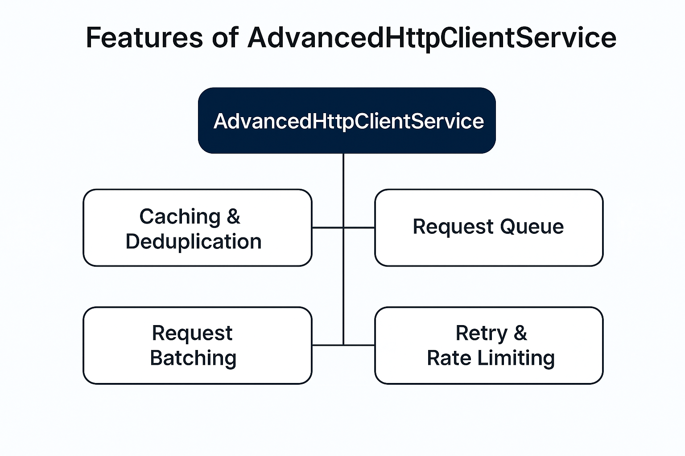

# AdvancedHttpClient



AdvancedHttpClient is a feature-rich HTTP service for Angular that augments the standard HttpClient with production-grade capabilities:

- In-memory cache with expiration
- Inflight de-duplication and result sharing
- Rate limiting and debounce
- Request queueing (sequential/parallel) with concurrency and priority
- Request batching with payload combine and per-item response selection
- Retry with backoff and customizable fallback
- Timeout handling
- Logging and optional server-side log shipping

Designed for high-traffic client apps to optimize network usage and control load.

## Installation and Basic Usage

Install the package and inject the service anywhere in your app:

```sh
npm i @hasan-akbari/advanced-http-client
```

```ts
import { Component } from '@angular/core';
import { AdvancedHttpClientService } from '@hasan-akbari/advanced-http-client';

@Component({
  selector: 'app-demo',
  template: '...'
})
export class DemoComponent {
  constructor(private http: AdvancedHttpClientService) {}

  ngOnInit() {
    this.http.get<any>('https://jsonplaceholder.typicode.com/posts', { _limit: 5 })
      .subscribe(console.log);
  }
}
```

## Quick Start

- Params and headers:
```ts
import { HttpHeaders, HttpParams } from '@angular/common/http';

const params = new HttpParams().set('_limit', '5').set('_page', '2');
const headers = new HttpHeaders({ 'X-Mode': 'demo' });

http.send<any>('https://jsonplaceholder.typicode.com/posts', undefined, {
  method: 'GET', params, headers
}).subscribe();
```

- Inflight de-dup and result sharing:
```ts
// two subscribers, one outbound request; result is shared via shareReplay
http.get<any>('https://jsonplaceholder.typicode.com/posts/1').subscribe();
http.get<any>('https://jsonplaceholder.typicode.com/posts/1').subscribe();
```

- Raw mode to bypass dedup/shareReplay:
```ts
http.get<any>('https://jsonplaceholder.typicode.com/posts/1', {}, { raw: true }).subscribe();
http.get<any>('https://jsonplaceholder.typicode.com/posts/1', {}, { raw: true }).subscribe();
// two independent outbound requests will be sent
```

## Features and Examples

### Cache
Store successful responses in memory and serve from cache until expiration:
```ts
http.get('https://jsonplaceholder.typicode.com/posts/2', {}, { cacheDurationMs: 30000 }).subscribe();
```

### Debounce and Rate Limit
Debounce merges rapid calls; Rate Limit enforces minimum spacing between sends:
```ts
// only one request after 300ms
http.get('https://api.example.com/search', { q: 'ng' }, { debounceMs: 300 }).subscribe();

// second request is scheduled with at least 1000ms gap from the previous completion
http.get('https://api.example.com/items', {}, { rateLimitMs: 1000 }).subscribe();
```
Tech note: Rate Limit is computed against the "last completion time" (finalize). Subsequent calls are scheduled after the previous request fully completes.

### Queue
- Sequential: one-by-one execution
```ts
http.get('https://api.example.com/todos/1', {}, { queue: { enabled: true, mode: 'sequential', priority: 'normal' } }).subscribe();
http.get('https://api.example.com/todos/2', {}, { queue: { enabled: true, mode: 'sequential', priority: 'normal' } }).subscribe();
```

- Parallel with `concurrency`
```ts
http.get('https://api.example.com/comments', {}, { raw: true, queue: { enabled: true, mode: 'parallel', concurrency: 2, priority: 'high' } }).subscribe();
http.get('https://api.example.com/comments', {}, { raw: true, queue: { enabled: true, mode: 'parallel', concurrency: 2, priority: 'high' } }).subscribe();
http.get('https://api.example.com/comments', {}, { raw: true, queue: { enabled: true, mode: 'parallel', concurrency: 2, priority: 'high' } }).subscribe();
```
Note: Use `raw: true` in examples/tests to observe concurrency precisely; dedup otherwise may merge identical requests.

### Batch
Combine payloads and distribute responses using `combine` and `selector`:
```ts
const batchOpts = {
  method: 'GET',
  batch: {
    enabled: true,
    key: 'users-batch',
    size: 10,
    intervalMs: 0,
    combine: (arr: any[]) => arr.map(p => p.id),
    selector: (resp: any[], payload: any) => resp.find(u => u.id === payload.id)
  }
} as const;

const r1$ = http.send<any>('https://jsonplaceholder.typicode.com/users', { id: 1 }, batchOpts as any);
const r2$ = http.send<any>('https://jsonplaceholder.typicode.com/users', { id: 2 }, batchOpts as any);
const r3$ = http.send<any>('https://jsonplaceholder.typicode.com/users', { id: 3 }, batchOpts as any);

// For GET/HEAD/OPTIONS, IDs are merged into query using key "id"
// Example: .../users?id=1&id=2&id=3
r1$.subscribe(console.log);
r2$.subscribe(console.log);
r3$.subscribe(console.log);
```

### Retry and Fallback
Retry with backoff and a fallback value or function:
```ts
http.get('https://jsonplaceholder.typicode.com/posts', {}, {
  retry: {
    attempts: 2,               // two retries in addition to the initial request
    backoff: 'exponential',    // or 'linear'
    baseDelayMs: 50,
    maxDelayMs: 2000,
    shouldRetry: (err) => err.status >= 500,
    fallbackValue: { ok: true }
  }
}).subscribe(v => console.log('Result:', v));
```
Note: With `attempts = 2`, the cycle is initial request + 2 retries. If errors persist, `fallbackValue` is emitted from `catchError`.

### Timeout
```ts
http.get('https://jsonplaceholder.typicode.com/posts', {}, { timeoutMs: 10 })
  .subscribe({ error: e => console.error('Timeout:', e) });
```

### Logging
Send success/failure logs with levels and optional server shipping:
```ts
http.get('https://jsonplaceholder.typicode.com/posts', {}, {
  log: {
    enabled: true,
    level: 'basic', // 'none' | 'basic' | 'verbose'
    sendToServer: (entry) => fetch('/log', { method: 'POST', body: JSON.stringify(entry) })
  },
  debug: true // also print to console
}).subscribe();
```

## API Reference (options summary)

- `method`: one of `GET|POST|PUT|PATCH|DELETE|HEAD|OPTIONS`
- `params`: plain object for query params (converted to `HttpParams`)
- `headers`: plain object for headers (converted to `HttpHeaders`)
- `body`: payload for non-GET/HEAD/OPTIONS methods
- `raw`: bypass dedup/shareReplay; every call sends an independent request
- `cacheDurationMs`: cache TTL for successful responses
- `debounceMs`: delay to merge rapid calls
- `rateLimitMs`: minimum gap between request completions on the same key
- `queue`: `{ enabled, mode: 'sequential'|'parallel', concurrency?, priority: 'low'|'normal'|'high' }`
- `batch`: `{ enabled, key, size, intervalMs, combine(arr), selector(resp, payload) }`
- `retry`: `{ attempts, backoff: 'exponential'|'linear', baseDelayMs, maxDelayMs?, shouldRetry?, fallbackValue }`
- `timeoutMs`: timeout in milliseconds
- `log`: `{ enabled, level, sendToServer? }`
- `debug`: enable console debug beside `log`

## Technical Notes & Best Practices

- Dedup builds a composite key from `method + endpoint + params/body` and shares the result via `shareReplay`.
- `raw: true` bypasses sharing/concurrency optimizations; use for specific scenarios or tests.
- For GET/HEAD/OPTIONS batching, the `id` key is used in the query. If you need another key, customize `combine` and endpoint construction.
- When both `debounceMs` and `rateLimitMs` are set, the effective delay is the largest necessary value.
- In-memory cache is process-local and not durable; use a separate storage layer if you need persistence.

## Testing, Build and Publish

- Run unit tests: `npx ng test advanced-http-client --watch=false --browsers=ChromeHeadless`
- Build the library: `npx ng build advanced-http-client`
- Publish: after build, `cd dist/advanced-http-client` and run `npm publish`

## License

This project showcases an advanced HTTP client pattern for Angular. Evaluate and adapt it to your production needs before use.
