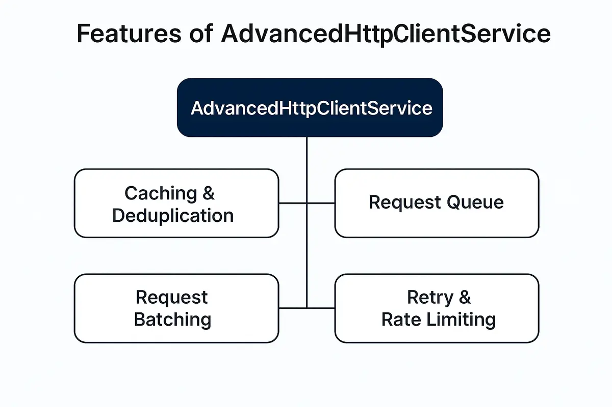

# AdvancedHttpClient (Demo Project)

[](https://github.com/Hasan-Akbari/angular-advanced-http-client) [](LICENSE)



## Demo

- Live: https://hasan-akbari.github.io/angular-advanced-http-client/


Production‑grade Angular HTTP client that augments `HttpClient` with caching, inflight de‑duplication, rate limiting, debouncing, queueing/concurrency, batching, retry/backoff, timeout, and logging.

---

## Highlights

| Capability | What it does |
|---|---|
| Cache | In‑memory cache with TTL for successful responses |
| Inflight de‑dup | Merges equivalent requests; shares results via `shareReplay` |
| Rate limit & Debounce | Controls call rate and merges rapid bursts |
| Queue & Concurrency | Sequential or parallel processing with priority and capacity |
| Batching | Combines payloads and distributes responses via `selector` |
| Retry/Backoff | Retries with exponential/linear backoff and fallback |
| Timeout | Per‑request timeout handling |
| Logging | Structured logs with optional server shipping |

> [!TIP]
> Use `raw: true` in tests to disable automatic de‑duplication when you need to observe concurrency precisely.

---

## Installation

```sh
npm i @hasan-akbari/advanced-http-client
```

```ts
import { AdvancedHttpClientService } from '@hasan-akbari/advanced-http-client';
```

<details>
  <summary><strong>Quick Start</strong></summary>

```ts
// Params and headers
import { HttpHeaders, HttpParams } from '@angular/common/http';
const params = new HttpParams().set('_limit', '5').set('_page', '2');
const headers = new HttpHeaders({ 'X-Mode': 'demo' });

http.send<any>('https://jsonplaceholder.typicode.com/posts', undefined, {
  method: 'GET', params, headers
}).subscribe();
```

```ts
// Inflight de‑dup and result sharing
http.get<any>('https://jsonplaceholder.typicode.com/posts/1').subscribe();
http.get<any>('https://jsonplaceholder.typicode.com/posts/1').subscribe();
```

```ts
// Raw mode to bypass de‑dup/shareReplay
http.get<any>('https://jsonplaceholder.typicode.com/posts/1', {}, { raw: true }).subscribe();
http.get<any>('https://jsonplaceholder.typicode.com/posts/1', {}, { raw: true }).subscribe();
```
</details>

---

## Options Overview

| Option | Type / Example | Description |
|---|---|---|
| `method` | `'GET'|'POST'|...` | HTTP verb for `send()` |
| `params` | Plain object | Converted to `HttpParams` |
| `headers` | Plain object | Converted to `HttpHeaders` |
| `raw` | `boolean` | Bypass de‑dup; every call sends independently |
| `cacheDurationMs` | `number` | TTL for caching successful responses |
| `debounceMs` | `number` | Merge rapid calls; delays send |
| `rateLimitMs` | `number` | Minimum gap between completions on same key |
| `queue` | `{ enabled, mode, concurrency?, priority }` | Sequential/parallel pipeline control |
| `batch` | `{ enabled, key, size, intervalMs, combine, selector }` | Group payloads and split responses |
| `retry` | `{ attempts, backoff, baseDelayMs, maxDelayMs?, shouldRetry?, fallbackValue }` | Resilience configuration |
| `timeoutMs` | `number` | Per‑request timeout |
| `log` | `{ enabled, level, sendToServer? }` | Logging and optional server shipping |
| `debug` | `boolean` | Console debugging alongside logs |

> [!NOTE]
> Cache is process‑local and not durable. Use a persistent store if you need cross‑session caching.

---

## Usage Patterns

```ts
// Cache successful responses for 30s
http.get('https://jsonplaceholder.typicode.com/posts/2', {}, { cacheDurationMs: 30000 }).subscribe();
```

```ts
// Debounce rapid calls; Rate‑limit enforces minimum spacing between completions
http.get('https://api.example.com/search', { q: 'ng' }, { debounceMs: 300 }).subscribe();
http.get('https://api.example.com/items', {}, { rateLimitMs: 1000 }).subscribe();
```

```ts
// Sequential queue
http.get('https://api.example.com/todos/1', {}, { queue: { enabled: true, mode: 'sequential', priority: 'normal' } }).subscribe();
http.get('https://api.example.com/todos/2', {}, { queue: { enabled: true, mode: 'sequential', priority: 'normal' } }).subscribe();
```

```ts
// Parallel with concurrency
http.get('https://api.example.com/comments', {}, { raw: true, queue: { enabled: true, mode: 'parallel', concurrency: 2, priority: 'high' } }).subscribe();
```

```ts
// Batching (GET) with combine/selector
const batchOpts = {
  method: 'GET',
  batch: {
    enabled: true,
    key: 'users-batch',
    size: 10,
    intervalMs: 0,
    combine: (arr: any[]) => arr.map(p => p.id),
    selector: (resp: any[], payload: any) => resp.find(u => u.id === payload.id)
  }
} as const;
http.send<any>('https://jsonplaceholder.typicode.com/users', { id: 1 }, batchOpts as any).subscribe();
```

```ts
// Retry with exponential backoff and fallback
http.get('https://jsonplaceholder.typicode.com/posts', {}, {
  retry: {
    attempts: 2,
    backoff: 'exponential',
    baseDelayMs: 50,
    maxDelayMs: 2000,
    shouldRetry: (err) => err.status >= 500,
    fallbackValue: { ok: true }
  }
}).subscribe(v => console.log('Result:', v));
```

```ts
// Timeout and logging
http.get('https://jsonplaceholder.typicode.com/posts', {}, {
  timeoutMs: 10,
  log: { enabled: true, level: 'basic' },
  debug: true
}).subscribe();
```

---

## Compatibility

| Angular | RxJS | Node |
|---|---|---|
| ^17.3.0 | ^7.8.0 | 18+ recommended |

---

## Build & Publish

- Build: `npx ng build advanced-http-client`
- Publish: `cd dist/advanced-http-client && npm publish`

---

## License
MIT
